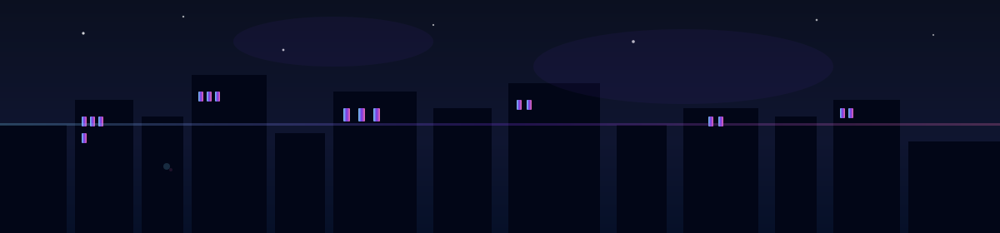

<!-- Night city header image -->

	

# Hi, I’m Merrick Hare 👋

> Data Engineer & Builder — founder of Enterprise Hare LLC

[Website](https://merrickhare.com) • [GitHub](https://github.com/merrickhare)

<!-- Neon badges -->

	
	
	
	
	
	
	

## About

I build reliable data pipelines, SaaS tools, and playful web experiences. My site blends engineering with visual polish — you'll find Three.js experiments, Tailwind-powered layouts, and small projects I use for learning and fun.

I enjoy solving data problems, automating workflows, and turning messy systems into maintainable, fast platforms.

## What I work on

- Data engineering: ETL, data modeling, orchestration, analytics
- Backend engineering: Python, SQL, APIs
- Frontend & visuals: interactive demos with Three.js, Tailwind CSS
- Small SaaS & tooling to automate repetitive workflows

## Featured Projects

- Website — a living portfolio and playground: https://merrickhare.com
- Shooter demo — small game/experiment in this repo: [shooter](../shooter/)
- Logo & favicon assets: [images/rabbit-logo.svg](../images/rabbit-logo.svg)

## Quick links

- GitHub: https://github.com/merrickhare
- Portfolio: https://merrickhare.com

## Want to connect?

Open an issue on my GitHub repo or reach out via the links above. I respond faster to project-related notes and collaborative ideas.

---

Thanks for stopping by — build something fun today ✨
